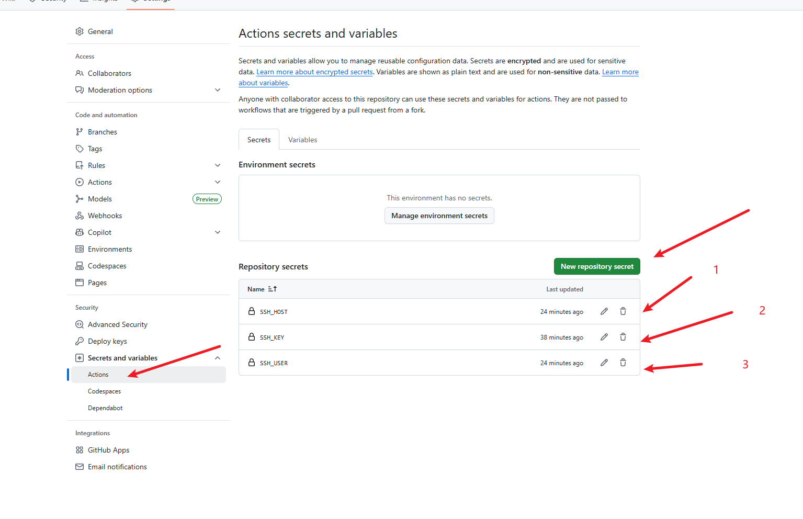
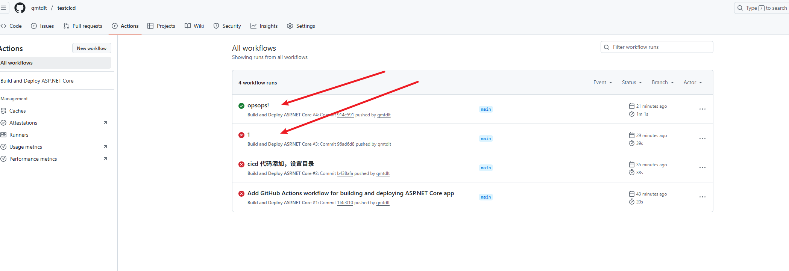
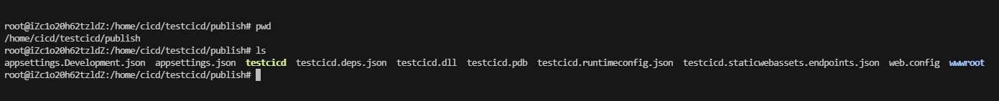

# CICD 极简步骤

### 1. 作用
提交代码、自动部署，高级一点自动跑测试
### 2. 极简完成的CICD的要求
- 能访问github（gitee理论也可以）
- 一个有IPV4的公网服务器
- 配置号github的公私钥
### 3. 步骤

- 3.1 再github创建一个仓库
- 3.2 开发拉取计算机拉取仓库
- 3.3 本地创建一个代码工程，这里要注意自己工程的路径,以下是我的代码文件夹结构，这个后面写配置文件要用
```
/testcicd
└── src
    └── code
        └── testcicd
            ├── testcicd.sln
            └── testcicd/
                └── testcicd.csproj
```
- 3.4 按照目录创建一个deploy.yml文件
```
/testcicd/
├── .git/
├── .github/
│   └── workflows/
│       └── deploy.yml
```
- 3.5 github action 配置

> 这里需要分别设置SSH_HOST（公网ipv4，或者域名，不能使用ipv6），SSH_USER（服务）登录用户名，SSH_KEY（开发计算机的github私钥）


  
- 3.6 测试服务器添加github公钥

> 服务器执行
```
echo "你的公钥内容" >> ~/.ssh/authorized_keys
```
> 开发计算机测试公钥是否生效(如果能使用私钥连接服务器，说明设置成功)
```
ssh -i ~/.ssh/github_id_rsa root@服务器ip
```
- 3.7 编辑文件
```
name: Build and Deploy ASP.NET Core

on:
  push:
    branches: [ main ]          # github的分支名称

jobs:
  build-and-deploy:
    runs-on: ubuntu-latest      # 操作系统，我这是ubuntu

    steps:
    - name: Checkout code       # 下载代码
      uses: actions/checkout@v3

    - name: Setup .NET SDK 9.0
      uses: actions/setup-dotnet@v3
      with:
        dotnet-version: '9.0.x'     # 安装dotnet，只要大版本号似乎就可以

    - name: Publish app
      run: dotnet publish ./src/code/testcicd/testcicd.sln -c Release -o publish            # 执行发布，这里要注意路径

    - name: Upload to Ubuntu server
      uses: appleboy/scp-action@v0.1.4  # 将发布文件推送到服务器
      with:
        host: ${{ secrets.SSH_HOST }}   # github action 配置的SSH_HOST，也就是服务器公网ip或者域名
        username: ${{ secrets.SSH_USER }}# github action 配置的SSH_USER，也就是服务器的登录用户
        key: ${{ secrets.SSH_KEY }}     # github action 配置的SSH_KEY，也就是github的私钥
        source: "publish/*"
        target: "/home/cicd/testcicd"

```

- 3.8 提交代码并push到github，进入github action界面就能看到自动化的执行步骤了


- 3.9 上服务器检查，发现发布文件已经到了服务器


### 4. 问题

- 4.1 cicd到这一步只是完成了帮你提交代码，自动发布并推送至测试服务器
- 4.2 你还需要自己再服务器安装dotnet运行时，或者将服务作为systemd后台服务也需要自己进行
- 4.3 理论上，私有化部署gitlab也是类似的流程，但是gitlab对服务器配置要求较高
